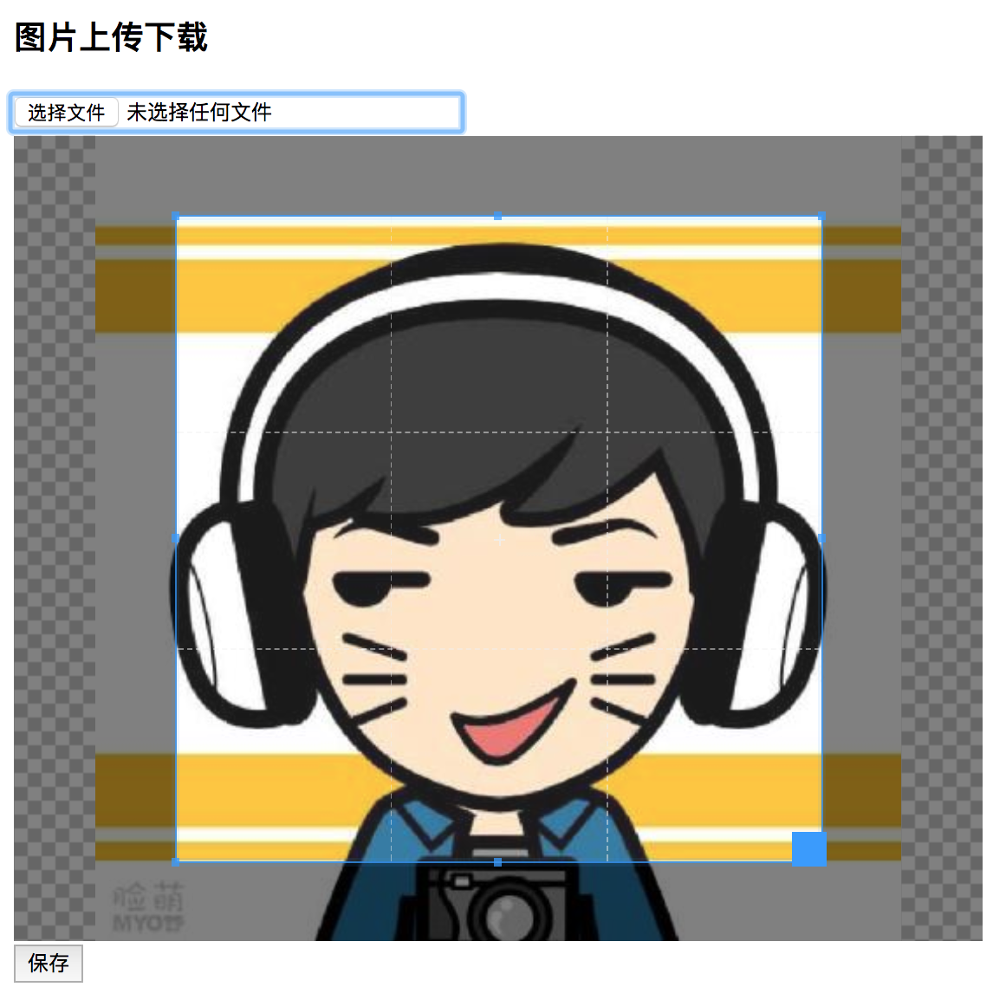

koa2 / jquery / cropper / cloudinary

## 前端

> 选择图片
```
<xmp>
<input id="fileupload" type="file" name="files[]" multiple>
<div class="img-preview" style="margin: 2px"></div>
<div>
    
</div>
<button id="uploadImage">保存</button>
</xmp>
```
> 预览图片
```
var $image = $("#image");
var $inputImage = $("#fileupload");
var URL = window.URL || window.webkitUIL;

if(URL) {
    $inputImage.change(function () {
        var files = this.files;
        var file;

        if (!$image.data('cropper')) {
            return;
        }
        console.log(files);
        if (files && files.length) {
            file = files[0];
            if (/^image\/\w+$/.test(file.type)) {
                blobURL = URL.createObjectURL(file);
                $image.one('built.cropper', function () {
                    // Revoke when load complete
                    URL.revokeObjectURL(blobURL);
                }).cropper('reset').cropper('replace', blobURL);
                $inputImage.val('');
            } else {
                window.alert('Please choose an image file.');
            }
        }
    });
} else {
    $inputImage.prop('disabled', true).parent().addClass('disabled');
}

$image.cropper({
    aspectRatio: 1 / 1,
    preview: '.img-preview',
    crop: function(e) {
        // Output the result data for cropping image.
        // console.log(e.x);
        // console.log(e.y);
        // console.log(e.width);
        // console.log(e.height);
        // console.log(e.rotate);
        // console.log(e.scaleX);
        // console.log(e.scaleY);
    },
});
```
> 上传图片
```
$('#uploadImage').on('click', function () {
    console.log('上传所选');
    $('#image').cropper('getCroppedCanvas', {
        width: 148,
        height: 148,
    }).toBlob(function (blob) {
        console.log(blob.size);
        if ((blob.size / 1024) > 1024) {
            alert('图片文件过大!');
            return;
        }
        let formData = new FormData();
        formData.append('avatarFile', blob);
        $.ajax({
            url: '/api/upload',
            type: "POST",
            dataType: 'json',
            data: formData,
            processData: false,
            contentType: false,
            success: function (message) {
                console.log(message);
                if (message.result) {
                    console.log('Upload success');
                    let d = new Date();
                    $('#avatar').attr("src", message.avatarUrl + '?' + d.getTime());
                    $('#userCardAvatar').attr("src", message.avatarUrl + '?' + d.getTime());
                    $('.ui.modal').modal('hide');
                    //window.location.reload();
                } else {
                    console.log('Upload failed');
                    $('#uploadImage').removeClass('loading');
                    $('#uploadImage').attr('disabled', false);
                }

            },
            error: function () {
                console.log('Upload error');
            }
        });
        $('#uploadImage').addClass('loading');
        $('#uploadImage').attr('disabled', true);
    });
});
```


## 后端
> cloudinary.js

```
var fs = require('fs')
var cloudinary = require('cloudinary')
var config = require('../../config/cloudinary.json')

cloudinary.config({
  'cloud_name': config.cloud_name,
  'api_key': config.api_key,
  'api_secret': config.api_secret
})

exports.upload = async (path) => {
  return new Promise(function (resolve, reject) {
    cloudinary.uploader.upload(path, function (result) {
      console.log(result)
      fs.readdir('./uploads', (err, files) => {
        if (err) {
          console.log(err)
        }
        for (var fileName in files) {
          if (fileName !== 'readme.md') {
            fs.unlink('./uploads/' + fileName, err => {
              if (err) {
                console.log(err)
              }
            })
          }
        }
      })
      resolve(result)
    })
  })
}
```

> upload.js
```
import cloudinary from '../src/lib/cloudinary'

exports.action = async(ctx) => {
  console.log(ctx.request.body.files.avatarFile.path)
  var result = await cloudinary.upload(ctx.request.body.files.avatarFile.path)
  ctx.body = {
    data: result
  }
  return
}
```

## 相关入口
> [cloudinary 文档](https://cloudinary.com/documentation/node_integration#getting_started_guide)
